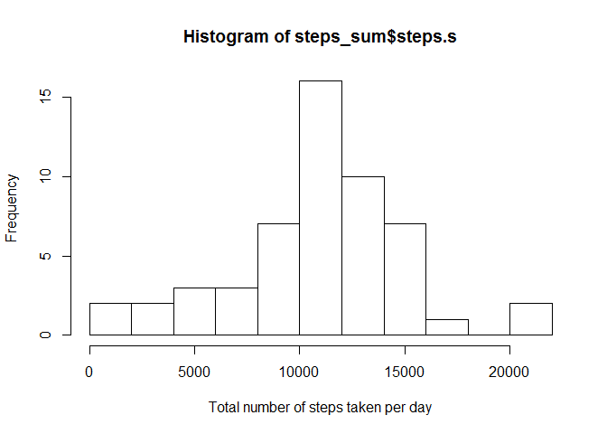
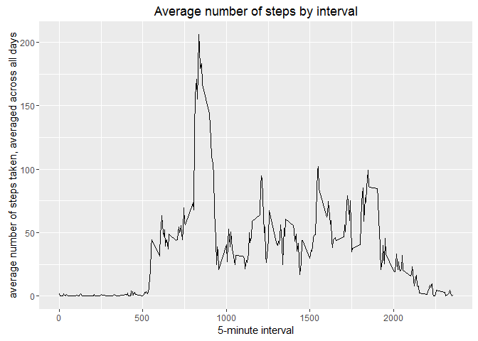
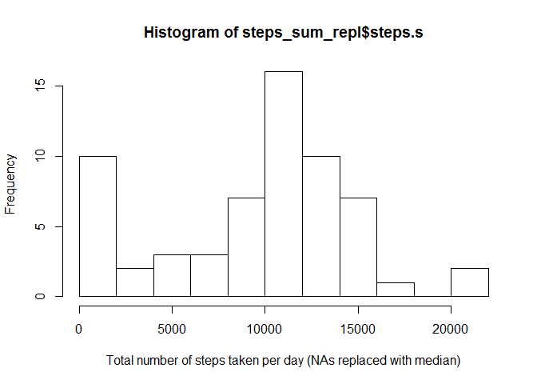
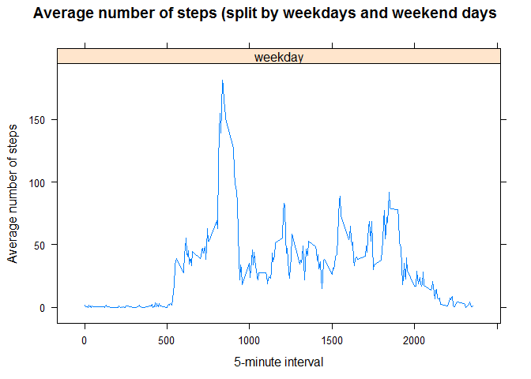

# Reproducible research - Course Project week1
Claudio Caponera  
02 October 2016  

##Introduction

It is now possible to collect a large amount of data about personal movement using activity monitoring devices such as a Fitbit, Nike Fuelband, or Jawbone Up. These type of devices are part of the "quantified self" movement - a group of enthusiasts who take measurements about themselves regularly to improve their health, to find patterns in their behavior, or because they are tech geeks. But these data remain under-utilized both because the raw data are hard to obtain and there is a lack of statistical methods and software for processing and interpreting the data.
This assignment makes use of data from a personal activity monitoring device. This device collects data at 5 minute intervals throughout the day. The data consists of two months of data from an anonymous individual collected during the months of October and November, 2012 and include the number of steps taken in 5 minute intervals each day.

##Data

The dataset is stored in a comma-separated-value (CSV) file and there are a total of 17,568 observations in this dataset.

The variables included in this dataset are:
1) steps: Number of steps taking in a 5-minute interval (missing values are coded as NA)
2) date: The date on which the measurement was taken in YYYY-MM-DD format
3) interval: Identifier for the 5-minute interval in which measurement was taken


###1) Reading data


```r
setwd("C:/Users/Claudio.Caponera/OneDrive for Business/Documents/datascience/Reproducible_Research")
```


```r
data <- read.table(unz("repdata-data-activity.zip", "activity.csv"), 
	header=T, quote="\"", sep=",")
```


```r
summary(data)
```

```
##      steps                date          interval     
##  Min.   :  0.00   2012-10-01:  288   Min.   :   0.0  
##  1st Qu.:  0.00   2012-10-02:  288   1st Qu.: 588.8  
##  Median :  0.00   2012-10-03:  288   Median :1177.5  
##  Mean   : 37.38   2012-10-04:  288   Mean   :1177.5  
##  3rd Qu.: 12.00   2012-10-05:  288   3rd Qu.:1766.2  
##  Max.   :806.00   2012-10-06:  288   Max.   :2355.0  
##  NA's   :2304     (Other)   :15840
```

```r
data$date <- as.Date(data$date) 
```


```r
str(data)
```

```
## 'data.frame':	17568 obs. of  3 variables:
##  $ steps   : int  NA NA NA NA NA NA NA NA NA NA ...
##  $ date    : Date, format: "2012-10-01" "2012-10-01" ...
##  $ interval: int  0 5 10 15 20 25 30 35 40 45 ...
```

```r
# 17568 obs. of  3 variables
```


```r
head(data)
```

```
##   steps       date interval
## 1    NA 2012-10-01        0
## 2    NA 2012-10-01        5
## 3    NA 2012-10-01       10
## 4    NA 2012-10-01       15
## 5    NA 2012-10-01       20
## 6    NA 2012-10-01       25
```


```r
tail(data)
```

```
##       steps       date interval
## 17563    NA 2012-11-30     2330
## 17564    NA 2012-11-30     2335
## 17565    NA 2012-11-30     2340
## 17566    NA 2012-11-30     2345
## 17567    NA 2012-11-30     2350
## 17568    NA 2012-11-30     2355
```

###2) Missing values


```r
dataOK <- na.omit(data)
str(dataOK)
```

```
## 'data.frame':	15264 obs. of  3 variables:
##  $ steps   : int  0 0 0 0 0 0 0 0 0 0 ...
##  $ date    : Date, format: "2012-10-02" "2012-10-02" ...
##  $ interval: int  0 5 10 15 20 25 30 35 40 45 ...
##  - attr(*, "na.action")=Class 'omit'  Named int [1:2304] 1 2 3 4 5 6 7 8 9 10 ...
##   .. ..- attr(*, "names")= chr [1:2304] "1" "2" "3" "4" ...
```

```r
#15264 obs. of  3 variables
```


```r
head(dataOK)
```

```
##     steps       date interval
## 289     0 2012-10-02        0
## 290     0 2012-10-02        5
## 291     0 2012-10-02       10
## 292     0 2012-10-02       15
## 293     0 2012-10-02       20
## 294     0 2012-10-02       25
```


###3) Calculating total number of steps taken per day - Making histogram


```r
#counting distinct days
days = length(unique(dataOK[,2]))
days
```

```
## [1] 53
```

```r
library(doBy)
```

```
## Warning: package 'doBy' was built under R version 3.2.5
```

```r
steps_sum <- summaryBy(steps ~ date, data = dataOK,	FUN = function(x) { c(m = sum(x)) } )

#renaming column name
names(steps_sum)[names(steps_sum)=="steps.m"] <- "steps.s"

hist <- hist(	steps_sum$steps.s, breaks=10, xlab="Total number of steps taken per day")
```

<!-- -->

```r
hist
```

```
## $breaks
##  [1]     0  2000  4000  6000  8000 10000 12000 14000 16000 18000 20000
## [12] 22000
## 
## $counts
##  [1]  2  2  3  3  7 16 10  7  1  0  2
## 
## $density
##  [1] 1.886792e-05 1.886792e-05 2.830189e-05 2.830189e-05 6.603774e-05
##  [6] 1.509434e-04 9.433962e-05 6.603774e-05 9.433962e-06 0.000000e+00
## [11] 1.886792e-05
## 
## $mids
##  [1]  1000  3000  5000  7000  9000 11000 13000 15000 17000 19000 21000
## 
## $xname
## [1] "steps_sum$steps.s"
## 
## $equidist
## [1] TRUE
## 
## attr(,"class")
## [1] "histogram"
```


###4) Calculating and reporting mean and median of total number of steps taken per day


```r
mean(steps_sum$steps.s) 
```

```
## [1] 10766.19
```


```r
median(steps_sum$steps.s) 
```

```
## [1] 10765
```

###5) Calculate and plot average steps for each of 5-minute interval


```r
library(doBy)
steps_avg <- summaryBy(steps ~ interval, data = dataOK, 
 	FUN = function(x) { c(m = mean(x)) } )

#renaming column name
names(steps_avg)[names(steps_avg)=="steps.m"] <- "stepsavg"

library(ggplot2)
```

```
## Warning: package 'ggplot2' was built under R version 3.2.5
```

```r
qplot(x=interval, y=stepsavg, data = steps_avg,  geom = "line",
      xlab="5-minute interval",
      ylab="average number of steps taken, averaged across all days",
      main="Average number of steps by interval"
      )
```

<!-- -->

###6) Which 5-minute interval, on average across all the days in the dataset, contains the maximum number of steps?


```r
steps_avg[which.max(steps_avg$stepsavg), ]
```

```
##     interval stepsavg
## 104      835 206.1698
```

###7) Dealing with missing values: there are a number of days/intervals where there are missing values (coded as NA).


```r
#7a) Calculate and report the total number of missing values in the dataset

missing_steps <- subset(data, is.na(data$steps))
str(missing_steps)
```

```
## 'data.frame':	2304 obs. of  3 variables:
##  $ steps   : int  NA NA NA NA NA NA NA NA NA NA ...
##  $ date    : Date, format: "2012-10-01" "2012-10-01" ...
##  $ interval: int  0 5 10 15 20 25 30 35 40 45 ...
```

```r
# 2304 obs. of  3 variables
```


```r
missing_date <- subset(data, is.na(data$date))
str(missing_date)
```

```
## 'data.frame':	0 obs. of  3 variables:
##  $ steps   : int 
##  $ date    :Class 'Date'  num(0) 
##  $ interval: int
```

```r
#0 obs. of  3 variables
```


```r
missing_int <- subset(data, is.na(data$interval))
str(missing_int)
```

```
## 'data.frame':	0 obs. of  3 variables:
##  $ steps   : int 
##  $ date    :Class 'Date'  num(0) 
##  $ interval: int
```

```r
#0 obs. of  3 variables
```
Conclusion: only in 'steps' column there are NA's. Where 'steps' is missing, this will be now replaced with the median


```r
##7b) Where steps is missing, replacing with median.

library(doBy)
steps_med <- summaryBy(steps ~ interval, data = dataOK, 
 	FUN = function(x) { c(m = median(x)) } )

names(steps_med)[names(steps_med)=="steps.m"] <- "stepsmed"

missing_steps_repl <- merge(missing_steps,steps_med,by="interval")

myvars <- c("interval", "date", "stepsmed")
missing_steps_OK <- missing_steps_repl[myvars]
names(missing_steps_OK)[names(missing_steps_OK)=="stepsmed"] <- "steps" 

#b1) calculating median for intervals

library(doBy)
steps_med <- summaryBy(steps ~ interval, data = dataOK, 
 	FUN = function(x) { c(m = median(x)) } )

#renaming column name
names(steps_med)[names(steps_med)=="steps.m"] <- "stepsmed"

#b2) merging missing_steps with steps_median
#    replace with interval-steps-median where steps is missing

missing_steps_repl <- merge(missing_steps,steps_med,by="interval")

myvars <- c("interval", "date", "stepsmed")
missing_steps_OK <- missing_steps_repl[myvars]
names(missing_steps_OK)[names(missing_steps_OK)=="stepsmed"] <- "steps" 
```

###7a) Create a new dataset that is equal to the original dataset but with the missing data filled in.


```r
data_repl <- rbind(dataOK,missing_steps_OK)
summary(data_repl)
```

```
##      steps          date               interval     
##  Min.   :  0   Min.   :2012-10-01   Min.   :   0.0  
##  1st Qu.:  0   1st Qu.:2012-10-16   1st Qu.: 588.8  
##  Median :  0   Median :2012-10-31   Median :1177.5  
##  Mean   : 33   Mean   :2012-10-31   Mean   :1177.5  
##  3rd Qu.:  8   3rd Qu.:2012-11-15   3rd Qu.:1766.2  
##  Max.   :806   Max.   :2012-11-30   Max.   :2355.0
```

```r
summary(dataOK)
```

```
##      steps             date               interval     
##  Min.   :  0.00   Min.   :2012-10-02   Min.   :   0.0  
##  1st Qu.:  0.00   1st Qu.:2012-10-16   1st Qu.: 588.8  
##  Median :  0.00   Median :2012-10-29   Median :1177.5  
##  Mean   : 37.38   Mean   :2012-10-30   Mean   :1177.5  
##  3rd Qu.: 12.00   3rd Qu.:2012-11-16   3rd Qu.:1766.2  
##  Max.   :806.00   Max.   :2012-11-29   Max.   :2355.0
```

###7b) Make a histogram of the total number of steps taken each day and Calculate and report the mean and median total number of steps taken per day.


```r
# d1) Calculating total number of steps taken per day - making histogram

library(doBy)
steps_sum_repl <- summaryBy(steps ~ date, data = data_repl, 
 	FUN = function(x) { c(m = sum(x)) } )

#renaming column name
names(steps_sum_repl)[names(steps_sum_repl)=="steps.m"] <- "steps.s"

hist(	steps_sum_repl$steps.s, 
	breaks=10, 
	xlab="Total number of steps taken per day (NAs replaced with median)")
```

<!-- -->

Conclusion: Imputing missing data on the estimates of the total daily number of steps, the mean of steps goes from 33 to 38. 

###7c) Calculating and reporting mean and median of total number of steps taken per day


```r
mean(steps_sum_repl$steps.s) 
```

```
## [1] 9503.869
```


```r
median(steps_sum_repl$steps.s) 
```

```
## [1] 10395
```

###8a) Create a new factor variable in the dataset with two levels, weekday and weekend, indicating whether a given date is a weekday or weekend day.Used the dataset with the filled-in missing values for this part. 


```r
data_repl$date <- weekdays(as.Date(data_repl$date))

weektime <- ifelse((data_repl$date) %in% c("sabato","domenica"),"weekend","weekday")
data_repl2 <- cbind(data_repl,weektime)

table(data_repl2$weektime)
```

```
## 
## weekday 
##   17568
```


###8b) Make a panel plot containing a time series plot of the 5-minute interval (x-axis) and the average number of steps taken, averaged across all weekday days or weekend days (y-axis).Used the dataset with the filled-in missing values for this part.


```r
library(doBy)
steps_avg_final <- summaryBy(steps ~ interval + weektime, data = data_repl2, 
 	FUN = function(x) { c(m = mean(x)) } )

#renaming column name
names(steps_avg_final)[names(steps_avg_final)=="steps.m"] <- "stepsavg"

library("lattice")
p <- xyplot(stepsavg ~ interval | factor(weektime), data=steps_avg_final, 
       type = 'l',
       main="Average number of steps (split by weekdays and weekend days",
       xlab="5-minute interval",
       ylab="Average number of steps")
print (p)    
```

<!-- -->

Conclusion: Yes, there are there differences in activity patterns between weekdays and weekends. The plot shows how the activity is higher during the weekend days.
