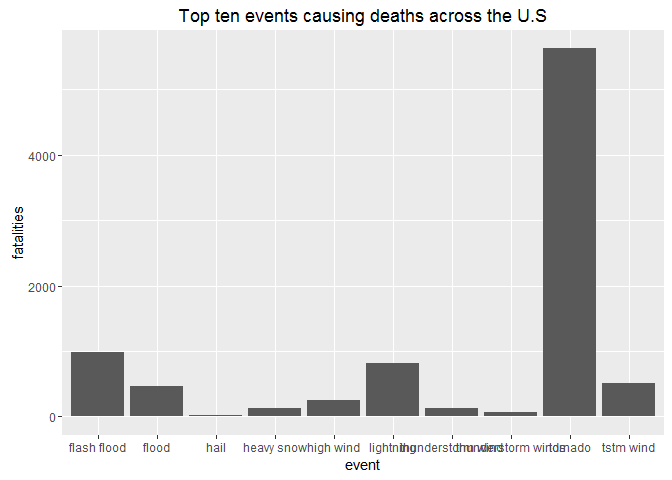
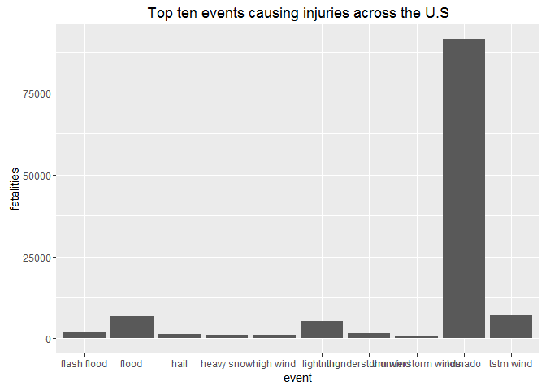
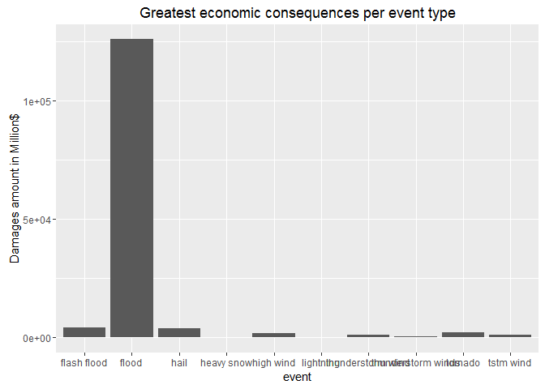

# Health and economic consequences of weather events in the U.S.
Claudio Caponera  
14 October 2016  

##Synopsis

Storms and other severe weather events can cause both public health and economic problems for communities and municipalities in the U.S. Many severe events can result in fatalities, injuries, and property damage, and preventing such outcomes to the extent possible is a key concern. The aim of this analysis is to identify which types of events are most harmful with respect to population health and which types of events have the greatest economic consequences. The project is based on the U.S. National Oceanic and Atmospheric Administration's storm database, which tracks characteristics of major storms and weather events in the U.S. Tornado has resulted as the most harmful event to health, flood the event with the gratest economic consequences.

##Data processing

The data for this assignment come in the form of a comma-separated-value file compressed via the bzip2 algorithm to reduce its size.

The events in the database start in the year 1950 and end in November 2011. In the earlier years of the database there are generally fewer events recorded, most likely due to a lack of good records. More recent years should be considered more complete.


```r
rm(list = ls())

setwd("C:/Users/Claudio.Caponera/OneDrive for Business/Documents/datascience/Reproducible_Research")

download.file("https://d396qusza40orc.cloudfront.net/repdata%2Fdata%2FStormData.csv.bz2",destfile="./stormdata.csv.bz2")
data <- read.csv("./stormdata.csv.bz2")
library(data.table)
```

```
## Warning: package 'data.table' was built under R version 3.2.5
```

```r
data <- data.table(data)

str(data)
```

```
## Classes 'data.table' and 'data.frame':	902297 obs. of  37 variables:
##  $ STATE__   : num  1 1 1 1 1 1 1 1 1 1 ...
##  $ BGN_DATE  : Factor w/ 16335 levels "1/1/1966 0:00:00",..: 6523 6523 4242 11116 2224 2224 2260 383 3980 3980 ...
##  $ BGN_TIME  : Factor w/ 3608 levels "00:00:00 AM",..: 272 287 2705 1683 2584 3186 242 1683 3186 3186 ...
##  $ TIME_ZONE : Factor w/ 22 levels "ADT","AKS","AST",..: 7 7 7 7 7 7 7 7 7 7 ...
##  $ COUNTY    : num  97 3 57 89 43 77 9 123 125 57 ...
##  $ COUNTYNAME: Factor w/ 29601 levels "","5NM E OF MACKINAC BRIDGE TO PRESQUE ISLE LT MI",..: 13513 1873 4598 10592 4372 10094 1973 23873 24418 4598 ...
##  $ STATE     : Factor w/ 72 levels "AK","AL","AM",..: 2 2 2 2 2 2 2 2 2 2 ...
##  $ EVTYPE    : Factor w/ 985 levels "   HIGH SURF ADVISORY",..: 834 834 834 834 834 834 834 834 834 834 ...
##  $ BGN_RANGE : num  0 0 0 0 0 0 0 0 0 0 ...
##  $ BGN_AZI   : Factor w/ 35 levels "","  N"," NW",..: 1 1 1 1 1 1 1 1 1 1 ...
##  $ BGN_LOCATI: Factor w/ 54429 levels "","- 1 N Albion",..: 1 1 1 1 1 1 1 1 1 1 ...
##  $ END_DATE  : Factor w/ 6663 levels "","1/1/1993 0:00:00",..: 1 1 1 1 1 1 1 1 1 1 ...
##  $ END_TIME  : Factor w/ 3647 levels ""," 0900CST",..: 1 1 1 1 1 1 1 1 1 1 ...
##  $ COUNTY_END: num  0 0 0 0 0 0 0 0 0 0 ...
##  $ COUNTYENDN: logi  NA NA NA NA NA NA ...
##  $ END_RANGE : num  0 0 0 0 0 0 0 0 0 0 ...
##  $ END_AZI   : Factor w/ 24 levels "","E","ENE","ESE",..: 1 1 1 1 1 1 1 1 1 1 ...
##  $ END_LOCATI: Factor w/ 34506 levels "","- .5 NNW",..: 1 1 1 1 1 1 1 1 1 1 ...
##  $ LENGTH    : num  14 2 0.1 0 0 1.5 1.5 0 3.3 2.3 ...
##  $ WIDTH     : num  100 150 123 100 150 177 33 33 100 100 ...
##  $ F         : int  3 2 2 2 2 2 2 1 3 3 ...
##  $ MAG       : num  0 0 0 0 0 0 0 0 0 0 ...
##  $ FATALITIES: num  0 0 0 0 0 0 0 0 1 0 ...
##  $ INJURIES  : num  15 0 2 2 2 6 1 0 14 0 ...
##  $ PROPDMG   : num  25 2.5 25 2.5 2.5 2.5 2.5 2.5 25 25 ...
##  $ PROPDMGEXP: Factor w/ 19 levels "","-","?","+",..: 17 17 17 17 17 17 17 17 17 17 ...
##  $ CROPDMG   : num  0 0 0 0 0 0 0 0 0 0 ...
##  $ CROPDMGEXP: Factor w/ 9 levels "","?","0","2",..: 1 1 1 1 1 1 1 1 1 1 ...
##  $ WFO       : Factor w/ 542 levels ""," CI","$AC",..: 1 1 1 1 1 1 1 1 1 1 ...
##  $ STATEOFFIC: Factor w/ 250 levels "","ALABAMA, Central",..: 1 1 1 1 1 1 1 1 1 1 ...
##  $ ZONENAMES : Factor w/ 25112 levels "","                                                                                                                               "| __truncated__,..: 1 1 1 1 1 1 1 1 1 1 ...
##  $ LATITUDE  : num  3040 3042 3340 3458 3412 ...
##  $ LONGITUDE : num  8812 8755 8742 8626 8642 ...
##  $ LATITUDE_E: num  3051 0 0 0 0 ...
##  $ LONGITUDE_: num  8806 0 0 0 0 ...
##  $ REMARKS   : Factor w/ 436781 levels "","-2 at Deer Park\n",..: 1 1 1 1 1 1 1 1 1 1 ...
##  $ REFNUM    : num  1 2 3 4 5 6 7 8 9 10 ...
##  - attr(*, ".internal.selfref")=<externalptr>
```

```r
head(data)
```

```
##    STATE__           BGN_DATE BGN_TIME TIME_ZONE COUNTY COUNTYNAME STATE
## 1:       1  4/18/1950 0:00:00     0130       CST     97     MOBILE    AL
## 2:       1  4/18/1950 0:00:00     0145       CST      3    BALDWIN    AL
## 3:       1  2/20/1951 0:00:00     1600       CST     57    FAYETTE    AL
## 4:       1   6/8/1951 0:00:00     0900       CST     89    MADISON    AL
## 5:       1 11/15/1951 0:00:00     1500       CST     43    CULLMAN    AL
## 6:       1 11/15/1951 0:00:00     2000       CST     77 LAUDERDALE    AL
##     EVTYPE BGN_RANGE BGN_AZI BGN_LOCATI END_DATE END_TIME COUNTY_END
## 1: TORNADO         0                                               0
## 2: TORNADO         0                                               0
## 3: TORNADO         0                                               0
## 4: TORNADO         0                                               0
## 5: TORNADO         0                                               0
## 6: TORNADO         0                                               0
##    COUNTYENDN END_RANGE END_AZI END_LOCATI LENGTH WIDTH F MAG FATALITIES
## 1:         NA         0                      14.0   100 3   0          0
## 2:         NA         0                       2.0   150 2   0          0
## 3:         NA         0                       0.1   123 2   0          0
## 4:         NA         0                       0.0   100 2   0          0
## 5:         NA         0                       0.0   150 2   0          0
## 6:         NA         0                       1.5   177 2   0          0
##    INJURIES PROPDMG PROPDMGEXP CROPDMG CROPDMGEXP WFO STATEOFFIC ZONENAMES
## 1:       15    25.0          K       0                                    
## 2:        0     2.5          K       0                                    
## 3:        2    25.0          K       0                                    
## 4:        2     2.5          K       0                                    
## 5:        2     2.5          K       0                                    
## 6:        6     2.5          K       0                                    
##    LATITUDE LONGITUDE LATITUDE_E LONGITUDE_ REMARKS REFNUM
## 1:     3040      8812       3051       8806              1
## 2:     3042      8755          0          0              2
## 3:     3340      8742          0          0              3
## 4:     3458      8626          0          0              4
## 5:     3412      8642          0          0              5
## 6:     3450      8748          0          0              6
```

```r
data$EVTYPE <- tolower(data$EVTYPE)

summary(data$INJURIES)
```

```
##      Min.   1st Qu.    Median      Mean   3rd Qu.      Max. 
##    0.0000    0.0000    0.0000    0.1557    0.0000 1700.0000
```

```r
summary(data$FATALITIES)
```

```
##     Min.  1st Qu.   Median     Mean  3rd Qu.     Max. 
##   0.0000   0.0000   0.0000   0.0168   0.0000 583.0000
```

```r
data$PROPDMG <- as.numeric(data$PROPDMG)
data$CROPDMG <- as.numeric(data$CROPDMG)
summary(data$PROPDMG)
```

```
##    Min. 1st Qu.  Median    Mean 3rd Qu.    Max. 
##    0.00    0.00    0.00   12.06    0.50 5000.00
```

```r
summary(data$CROPDMG)
```

```
##    Min. 1st Qu.  Median    Mean 3rd Qu.    Max. 
##   0.000   0.000   0.000   1.527   0.000 990.000
```

```r
data$CROPDMGEXP <- tolower(data$CROPDMGEXP)
data$PROPDMGEXP <- tolower(data$PROPDMGEXP)
table(data$CROPDMGEXP, exclude=NULL)
```

```
## 
##             ?      0      2      b      k      m   <NA> 
## 618413      7     19      1      9 281853   1995      0
```

```r
table(data$PROPDMGEXP, exclude=NULL)
```

```
## 
##             -      ?      +      0      1      2      3      4      5 
## 465934      1      8      5    216     25     13      4      4     28 
##      6      7      8      b      h      k      m   <NA> 
##      4      5      1     40      7 424665  11337      0
```

```r
#frequency table of EVTYPE
freq <- data.frame(table(data$EVTYPE, exclude=NULL))
freq <- freq[order(-freq$Freq), ]
freq$rel_freq <- round((freq$Freq/sum(freq$Freq)),digits=5)
freq$rel_freq_c <- cumsum(freq$rel_freq)

#looking at first most common events (90% data covered)
mce_freq <- head(freq,10)
mce <- data[EVTYPE %in% mce_freq$Var1]
#rm(data)
```

##Results

###1.Which types of events are most harmful with respect to population health?


```r
summ <- mce[,list(tot_INJURIES=sum(INJURIES,na.rm=TRUE), tot_FATALITIES=sum(FATALITIES,na.rm=TRUE)), by = EVTYPE]
summ 
```

```
##                 EVTYPE tot_INJURIES tot_FATALITIES
##  1:            tornado        91346           5633
##  2:          tstm wind         6957            504
##  3:               hail         1361             15
##  4: thunderstorm winds          908             64
##  5:          lightning         5230            816
##  6:  thunderstorm wind         1488            133
##  7:        flash flood         1777            978
##  8:              flood         6789            470
##  9:          high wind         1137            248
## 10:         heavy snow         1021            127
```

```r
library(ggplot2)
```

```
## Warning: package 'ggplot2' was built under R version 3.2.5
```

```r
a <- ggplot(mce,aes(EVTYPE, FATALITIES)) + geom_bar(stat = "identity") + ylab("fatalities") + xlab("event") + ggtitle("Top ten events causing deaths across the U.S")
a
```

<!-- -->

```r
b <- ggplot(mce,aes(EVTYPE, INJURIES)) + geom_bar(stat = "identity") + ylab("fatalities") + xlab("event") + ggtitle("Top ten events causing injuries across the U.S")
b
```

<!-- -->

###2.Which types of events have the greatest economic consequences?


```r
gec <- mce[PROPDMG > 0 & PROPDMGEXP %in% c("k","m","b") & CROPDMG > 0 & CROPDMGEXP %in% c("k","m","b"), ]

gec$CROPDMGEXP <- as.numeric(lapply(gec$CROPDMGEXP, function(x) if (x=="h") 100 else if (x=="k") 1000 else if (x=="m") 1e+06 else if (x=="b") 1e+09 else 0 ))

gec$PROPDMGEXP <- as.numeric(lapply(gec$PROPDMGEXP, function(x) if (x=="h") 100 else if (x=="k") 1000 else if (x=="m") 1e+06 else if (x=="b") 1e+09 else 0 ))

summ2 <- gec[,list(PRODMG_summ=sum(PROPDMG*PROPDMGEXP,na.rm=TRUE), CROPDMG_summ=sum(CROPDMG*CROPDMGEXP,na.rm=TRUE)), by = EVTYPE]
summ2 <- data.frame(summ2)
summ2$PRODMG_CROPDMG_summ <- rowSums(summ2[,c("PRODMG_summ","CROPDMG_summ")],na.rm=TRUE)

c <- ggplot(summ2,aes(EVTYPE, PRODMG_CROPDMG_summ/1000000)) + geom_bar(stat = "identity") + ylab("Damages amount in Million$") + xlab("event") + ggtitle("Greatest economic consequences per event type")
c
```

<!-- -->


